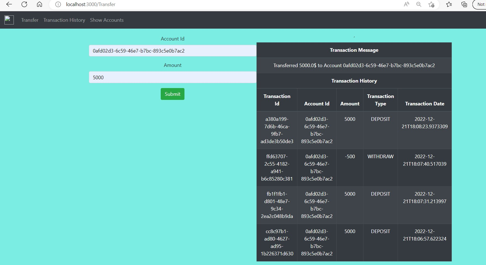
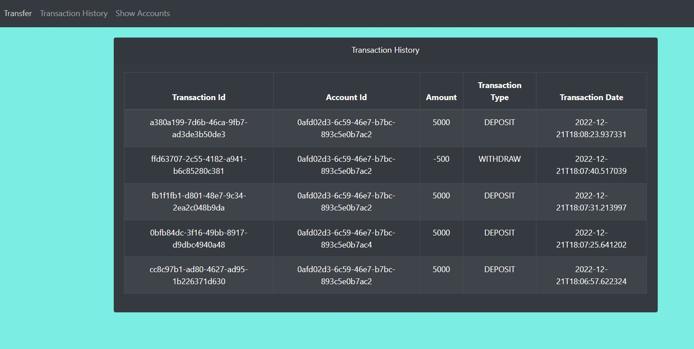
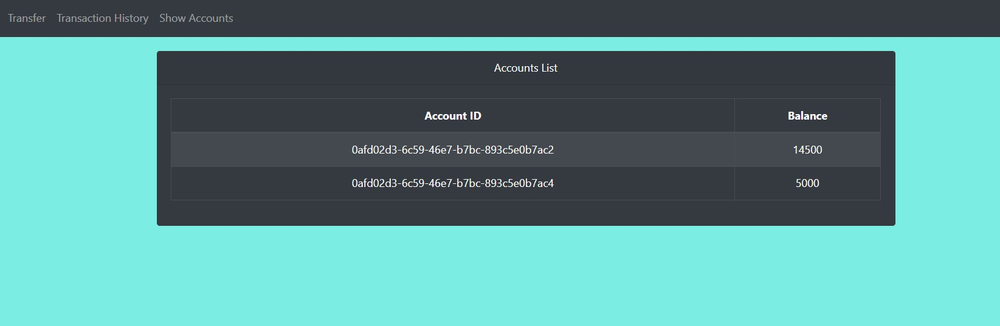
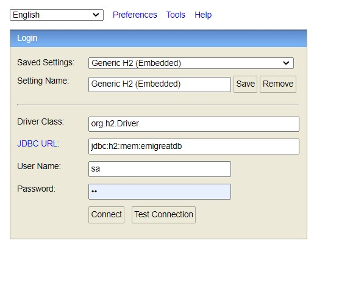
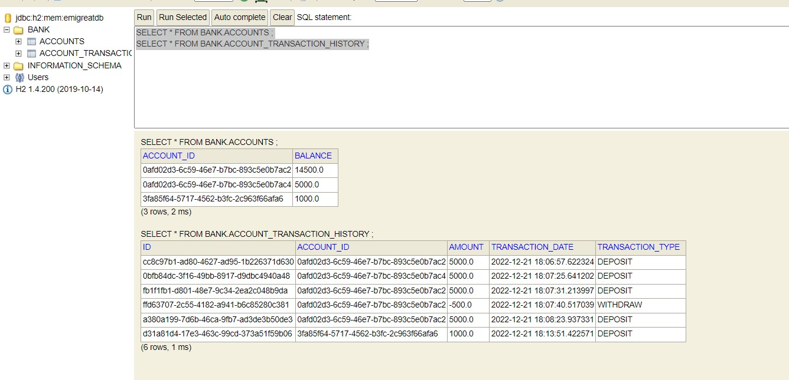
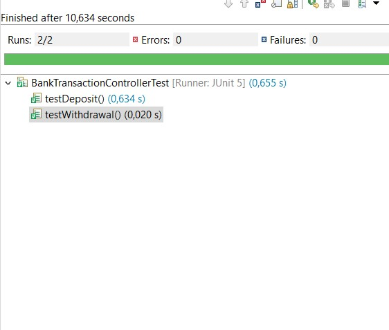
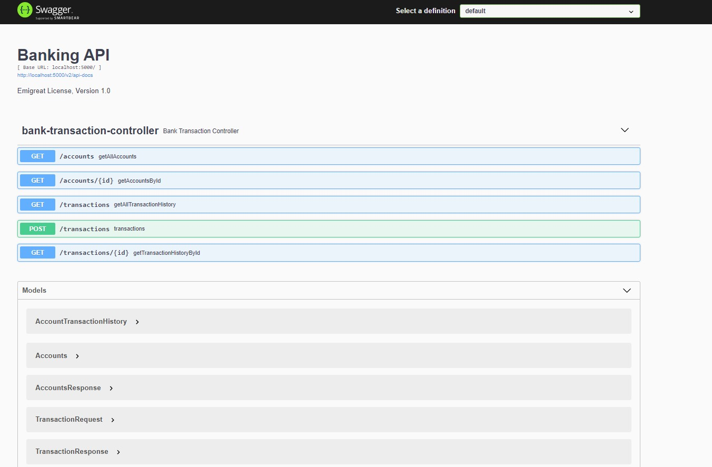
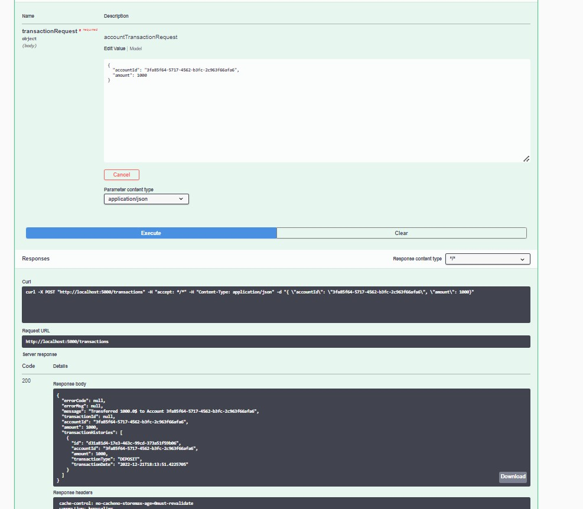

Banking Application

It is a REST API based application developed Using Springboot,  React and H2 Database

The following APIs are implemented:

- To Submit a Transaction for Deposit Or Withdrawal POST request: http://localhost:5000/transactions

- To Display All Transaction history for all the accounts using GET request: http://localhost:5000/transactions

- To Display a specific transaction by transaction id using GET request: http://localhost:5000/transactions/a380a199-7d6b-46ca-9fb7-ad3de3b50de3

- To display all the Accounts using GET request: http://localhost:5000/accounts

- To Search Account by Account Id using GET request: http://localhost:5000/accounts/3fa85f64-5717-4562-b3fc-2c963f66afa6

In order to use the full stack application,
1) Start the server by running the BankingApplication.java. Ensure that the none of the maven profiles are checked. 
2) Navigate to bankingapp directory and execute command "npm start"
3) Open browser, and visit "http://localhost:3000/", and the application should be up and running!

#Implementation Strategy:

#Transaction Screen :
1)  Transaction screen is having two fields with a Submit Button
     a. Account Id - USer has to enter this in UUID Format ( example: 0afd02d3-6c59-46e7-b7bc-893c5e0b7ac2	)
	 a. Amount - User has to enter Positive Amount for Deposit and Negative Amount for Withdrawal. (This will allow only numerics)

2) When Ever An Account id is given with an positive amount and click on Submit , Account Will be created and amount will be deposited.
   All Input fields will be created.
   Latest Transaction message will be displayed left side and also all transaction history will be displayed for that account.
   

#Transaction History Screen :

1) All Transaction history for all accounts will be shown here.

#Account Screen :

1) All Accounts with balance will be shown here.

#H2 Database For Storing Account and Transaction information

H2 DB can be accessed using URL -> http://localhost:5000/h2-console/

 ### Build application 

Run the below maven command on the com.emigreat.bank

**mvn clean install**

### Run application

    java -jar target/BankingApplication-1.0-SNAPSHOT.jar

# Configuration
The application configurations are placed in application.yml (Under src/main/resources)

# Test cases
Test cases are implemented for testing the Application REST endpoint with different inputs

API documentation is implemented through Swagger UI
#  Swagger UI Test

   
